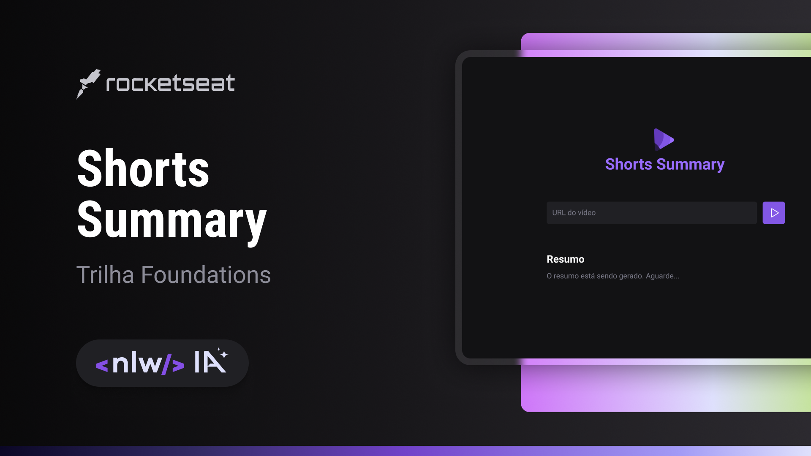

  

## 🤖 Shorts-Summary
Projeto utilizando modelos de IA para gerar resumo de Shorts do Youtube.

Desenvolvido durante o NLW IA da Rocketseat.

## 🛠 Tecnologias 

- HTML
- CSS
- JavaScript
- Node.js
- IA

## 🎨 Layout
Layout figma disponível em [link](https://www.figma.com/community/file/1282823495335498952).